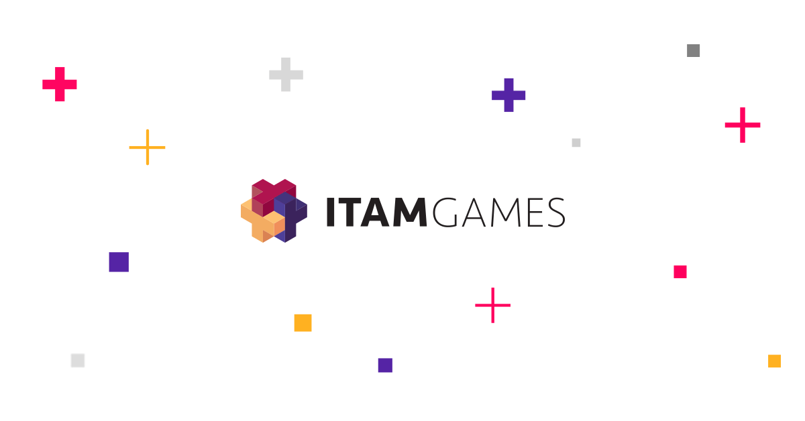

<div align="center">
    
</div>
<h1 align="center" >Vue Family Updates</h1>

## Vue, Vuex, Vue Router 등의 기술 업데이트


<div align="center">
    <div >
        ***********************************************************************
        <br/>
        <a href="https://www.itam.games/en">Our official website</a>
        <br/>
        <br/>
        <a href="https://itam.market/ko">Our Our market page</a>
        <br/>
        <br/>
        
        </a>
        <br/>
        ***********************************************************************
    </div>
</div>
<div align="center">

[Overview](#1-overview)&nbsp;&nbsp;&nbsp; |&nbsp;&nbsp;&nbsp;
[Technology](#2-technology)&nbsp;&nbsp;&nbsp; |&nbsp;&nbsp;&nbsp;
[Architecture](#3-architecture)&nbsp;&nbsp;&nbsp;|&nbsp;&nbsp;&nbsp;
[Features](#4-features)&nbsp;&nbsp;&nbsp;|&nbsp;&nbsp;&nbsp;[Setup](#5-setup)&nbsp;&nbsp;&nbsp;|&nbsp;&nbsp;&nbsp;[Deployment](#4-deployment)&nbsp;&nbsp;&nbsp;|&nbsp;&nbsp;&nbsp;[Contributions](#5-contributions)

</div>

---

## 1. Overview

Trip Log™ is a cloud image storage based on geographic location. Though Trip Log is aimed to expand creativity of our users through automatic mapping of photos and user friendly text editing interface, with Trip Cam, it can be expanded infinately more.Trip Log™ respects the privacy of our users. Although our users can share their stories via integrated image export or url, user decides if it is partially shared or the whole.

## 2. Technology

### Frontend

<div width="300px">


</div>

### Backend

<div width="400px">


</div>

### Hardware

<div width="300px">


</div>

## 3. Architecture

### Frontend


### Backend


### Hardware


## 4. Features

### Frontend


### Backend


### Hardware


## 5. Setup

### Frontend

1. Clone our repositry from GitHub

```
$ git clone https://github.com/sojournalists/sojournal.git
```

2. Install and set up [Android Studio](https://developer.android.com/studio)

3. Install dependencies

```
$ yarn install
```

4. Run Android emulator from Android Studio

5. Start Application

```
$ yarn android
```

### Backend

1. Clone our repositry from GitHub

```
$ git clone https://github.com/sojournalists/sojournal.git
```

2. Install dependencies

```
$ yarn install
```

3. Setup the Database

```
#Create database
$ createdb triplog

#Drop database
$ dropdb triplog

#Migration
$ yarn knex --knexfile=./db/knexfile.js migrate:latest

#Rollback
$ yarn knex --knexfile=./db/knexfile.js migrate:rollback

#Seed data
yarn knex --knexfile=./db/knexfile.js seed:run
```

3. Run Server

```
$ yarn node db/server.js
```

4. Run Server (Development)

```
$ yarn nodemon db/server.js
```

5. Now you can test server at localhost:4000/graphql

### Hardware

See Hardware [README](./raspberry-pi/README.md)

## 6. Contributions

To contribute to this app, make sure you create a branch and **ALWAYS** make a pull request. **DO NOT EDIT THE MASTER!**

`git checkout -b <branch_name>`

If you want to push your edited files to your remote file, run the following:

`git push <remote_name> <branch_name>`

---

<div align="center">
<b>LICENSE</b>: CC7 TEAM CYAN
</div>
<br/>
<div align="center">
<b>Linkedin</b>: <br/>

[Brian Lee](https://www.linkedin.com/in/briansunghaklee/)&nbsp;&nbsp;&nbsp; |&nbsp;&nbsp;&nbsp;[Omar Kalouti](https://www.linkedin.com/in/omar-kalouti/)&nbsp;&nbsp;&nbsp;|&nbsp;&nbsp;&nbsp;[Chaz Wilson](https://www.linkedin.com/in/chaz-wilson/)&nbsp;&nbsp;&nbsp;|&nbsp;&nbsp;&nbsp;[Keisuke Mori](https://www.linkedin.com/in/keisuke-mori/)
